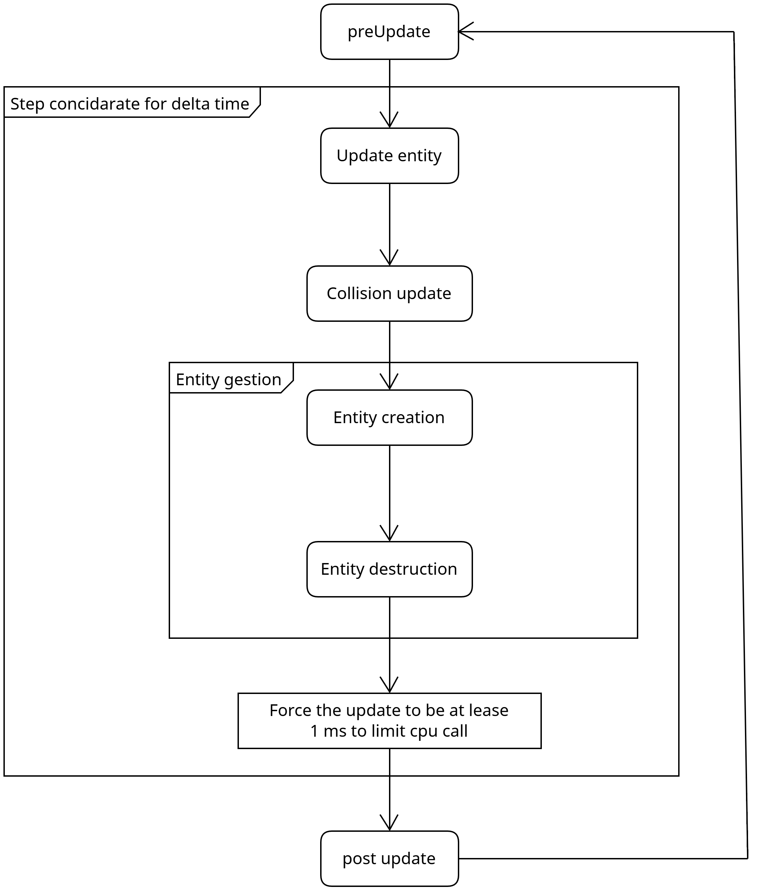

# Core game
Class use to manage the "core" of the game

## Update pipeline

    

#### *Why forcing a minimum of 1ms ?*
For many calculation we need the delta time between update but, with current generation of cpu and with not many entity, we can have update to fast (where the delta time is lease then the float epsilon) witch can break calculation. So avoid that, we force the minimum delta time per update to be 1 ms

#### *Why use a "entity gestion system" and not just change the updatables collection ?* 
We can destroy and create entity from a entity update, on top of being able to creat and destroy entity from a other thread, therefore this implementation simplify those operations
