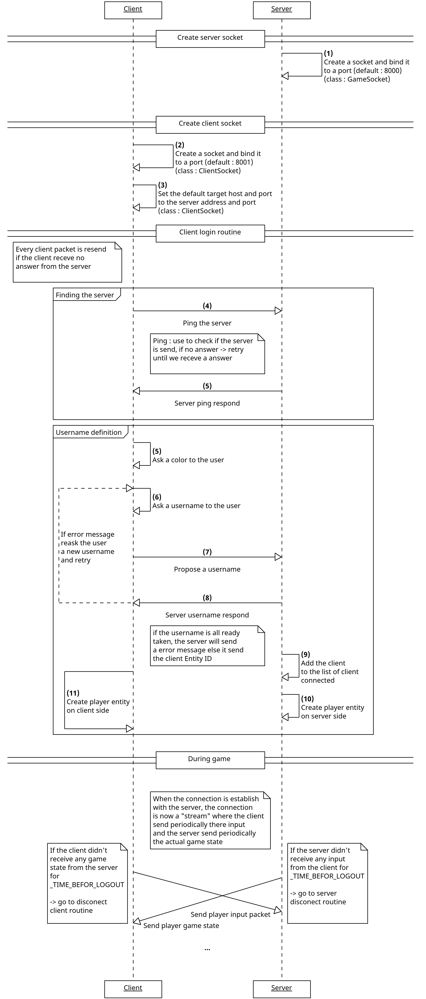
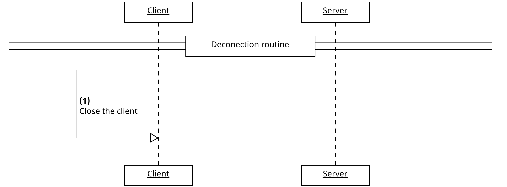

# Protocol
So, this application protocol is split in 4 bug part : 
- connection routine
- Server deconnection routine
- Client deconnection routine
- Owner command routine

In the code, those routine are describe in [GameSocket.java](/src/main/java/ch/heig/network/socket/GameSocket.java), [ClientSocket.java](/src/main/java/ch/heig/network/socket/ClientSocket.java), [ServerSocket.java](/src/main/java/ch/heig/network/socket/ServerSocket.java)

## Connection routine
This routine is use when a client try to connect to a server

    

The <strong><ins>during gamepart</ins></strong> is like à "stream" in a sense. The client send periodically there inputs and the server send game states. 
If the client no game state is received for a long time, it will call a time out and enter there deconection routine. And the same apply for the server if not input is received.

## Server deconnection routine

    

## Client deconnection routine

    

## Owner command routine
Any client can send owner routine, but only THE OWNER client will be concidare. During the "During game" state, the client can send (with there CLI) certain command to the server.
Those command are handle with a basic <strong><ins>Send -> Ack</ins></strong> logic. The client will send the command until it will recieve a respond from the server.

If the client is the owner, the server will send a acknowledgment with the command send

If the client is not the owner, the server will send a acknowledgment with a error message