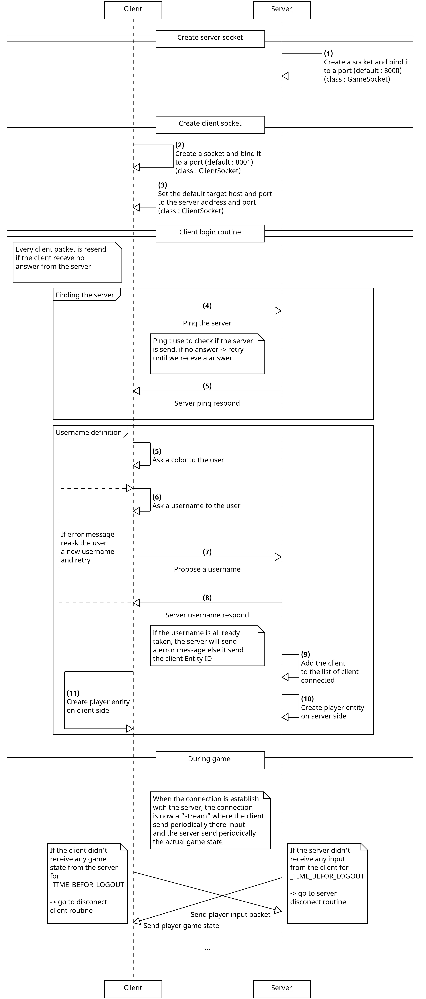
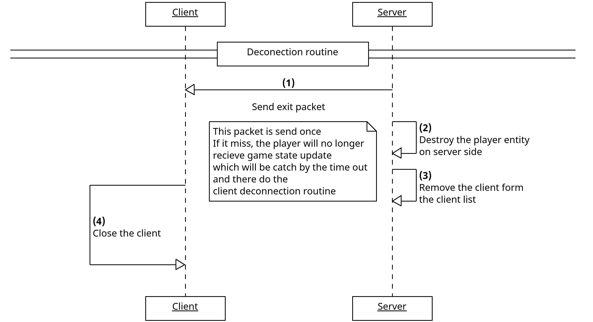
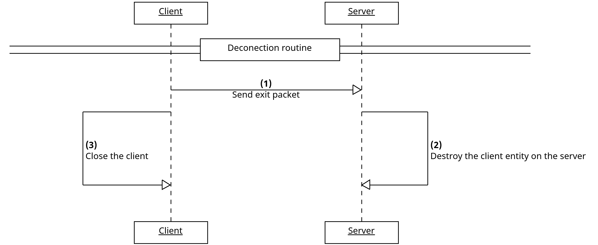
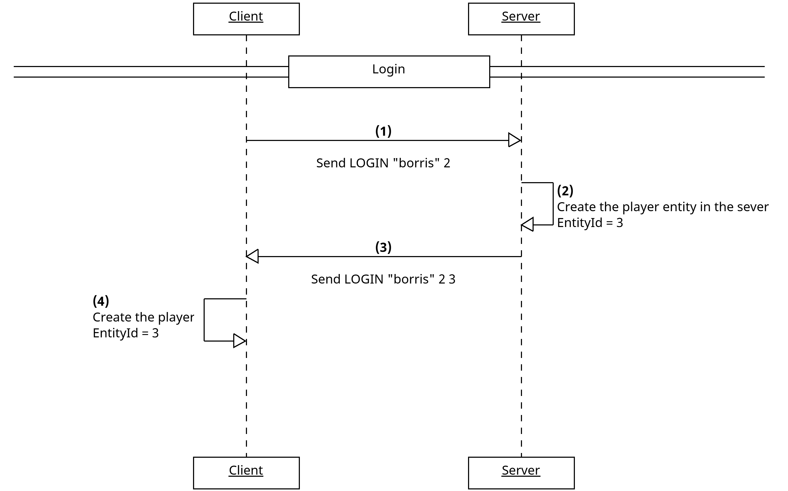
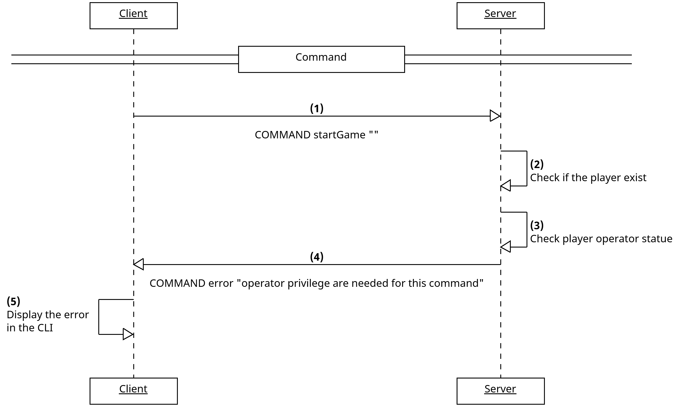

# Protocol
So, this protocol aim to resolve 4 main point : 
1) Exchange game state and player input between the server and the client
2) Player connecting/login in to a server
3) handle server/client disconnection
4) server gestion with operator command (command made by some player with privilege)

Those point are the main aspect of this protocol and they has bean the raison we made it like that.

## Transport protocol
The exchange of game state and player input need to be donne fast and regularly, beside, those data game state don't need any reliability. We only care about the latest game state, therefor, if we happen to miss a game state, we don't care, the next one is the new latest and so the only one we care. For the player it's a bit more complex but it can work as well with out reliability. Those point made our protocol use **UDP**.
Due to the use of **UDP**, a basic reliability system is needed to implement points 2-4, those will be define in the **message** section

UDP use a data gram system and so do we, to handle it there is the class [Packet](/src/main/java/ch/heig/network/packet/Packet.java) (it's not the best class name, but due the utilization of this class in the code, it was the best suiting name).
The [Packet](/src/main/java/ch/heig/network/packet/Packet.java) implement Serializable and is use to define the base data in every data gram in this protocol. This make the creation of new packet/message very simple, we only need to make a new class inheriting [Packet](/src/main/java/ch/heig/network/packet/Packet.java). But now we need a way to cast instance [Packet](/src/main/java/ch/heig/network/packet/Packet.java) to the right class (without crash). Cast is not free memory wise, so to handle that, [Packet](/src/main/java/ch/heig/network/packet/Packet.java) use a [PacketType](/src/main/java/ch/heig/network/packet/Packettype.java) enum in this definition. It's there to announce, before any cast, what this packet is. During the packet reception the following step are execute : 
- receive data gram
- make it a [Packet](/src/main/java/ch/heig/network/packet/Packet.java) instance
  - if the cast miss -> drop the packet
- from the type announce by the instance, handle the packet correctly (example, send back a ping packet or apply a game state packet)
- At this point we can spend more time in casting, so we use the [Packet.safeCast(Class)](/src/main/java/ch/heig/network/packet/Packet.java) to cast the instance in to the right class
  - if it miss, the packet is corrupt and therefor we drop it
- now we'r sure this packet is correct and not corrupt, we can finally trait it.

With that, normally we eliminated all corrupt data and we only cast when we really need to and, hopfully, save some process time by doing that.

To resume, ths protocol use UDP to send data gram and all data send/receive by this protocol is inheriting [Packet](/src/main/java/ch/heig/network/packet/Packet.java) to simplify data gestion and simplify packet handling.

## Message / Packet
This is the list of all message / packet exchangable in this protocol.
**NOTICE** : All the *usage* column aim to show the which data is needed by the packet to work (format : NAME [data name] ... ), but, in the code, all of that is handle with the constructor (use the link to the class to check it).

Also, for the majority of packet, the respond is often the same packet type with different data. The column *Sender → Receiver* is there to clarify that

And to finish, some of those message need acknowledgement. The way it's done is simple, send a packet, if no respond, then resend until there is a respond. The column *Need ack* is there to indicated that.


|Need ack|Sender → Receiver|Type|Java class|Description|Usage|
|---|---|---|---|---|---|
|✅|Client → Server|ping|[PingPacket](/src/main/java/ch/heig/network/packet/PingPacket.java)|Use to ping the server|PING|
|❌|Server → Client|ping|[PingPacket](/src/main/java/ch/heig/network/packet/PingPacket.java)|Respond of the server to a client ping|PING|
|✅|Client → Server|login|[LoginPacket](/src/main/java/ch/heig/network/packet/LoginPacket.java)|LOGIN [username] [player color] | Use to login the player.|
|❌|Server → Client|login|[LoginPacket](/src/main/java/ch/heig/network/packet/LoginPacket.java)|LOGIN [username] [player color] [entity id]| Respond of the server to a client login packet. There is 2 type of respond </br>1) the login **success** → the [entity id] is the entity id of player on the server</br>2) the login **fail** → in that case the **[entity id] = -1** to indicate a error.|
|❌|Server → Client|gameState|[GameStatePacket](/src/main/java/ch/heig/network/packet/GameStatePacket.java)|GAMESTATE [state id] [entity data 1] [entity data 2] ... |State of the game send to the client, it's contain a list of [EntityData](/src/main/java/ch/heig/network/packet/data/EntityData.java) (which is use to represent the state of entity needed to be sync)</br></br>To see the detail of the  data use by a specific entity, you can go to there class definition (in the [entity](/src/main/java/ch/heig/entity/) folder), in there, if the class implement **INetworkSender**, there they will be a sub-class named Data. This class represent the data send by the entity in the game state</br></br> this packet also as a ID aiming to make the client only use the latest state ID|
|❌|Client → Server|playerInput|[InputPacket](/src/main/java/ch/heig/network/packet/InputPacket.java)|INPUT [input data [5]]|Packet use to send input to the sever using [InputData](/src/main/java/ch/heig/network/packet/data/InputData.java). It's a list of 5 input to prevent data lost, every packet came with the 5 input prior to restore theme if missed.</br>This is not really useful for this project but for the futur I ([@TheoBensaci](https://github.com/TheoBensaci)) want to add client side prediction and lag compensation, and for that it will help.|
|✅|Client → Server|command|[CommandPacket](/src/main/java/ch/heig/network/packet/CommandPacket.java)|COMMAND [command type] [argument]|Packet use to send command to the server. This is the list of command possible (for now) : </br>- **startGame** : start the game</br>- **restartGame** : restart the game</br>- **cancelGame** : cancel the actual game</br>- **kickPlayer** [username] : kick the player named [username]</br>- **stopServer** : stop the server</br>- **players** : get the list of all player connected and they are a operator or not</br>- **op** [username] : make a player named [username] a operator </br>- **help** : get the list of possible command (change if the client is a operator or not)</br></br> **WARNING** : those command are not the actual command needed to be type in the CLI, to know theme use type ```help`` in the CLI when connected|
|❌|Server → Client|command|[CommandPacket](/src/main/java/ch/heig/network/packet/CommandPacket.java)|COMMAND [log or error] [message]|Packet use to send respond to a command send by a client. It use the same class as the command but change the command type to **log** or **error** depending of the outcome of the command.</br> When a command is receive, there is 3 main outcome : </br>1) the command is send by unknown client → send back a error message</br>2) the command is operator command and the client as no operator privilege → send back a error message</br>3) the command is send by client with the right privilege → execute the command and send back the outcome</br></br>To prevent re-execution, all command executed are log into the [ClientData](/src/main/java/ch/heig/network/ClientData.java) of the client. Command as ID set automatically by the client, if the server find the command receive the client log (by using the command ID) it send back the command output without re-executed it.|
|❌|Client → Server|exit|[b](/src/main/java/ch/heig/network/packet/PingExitPacketPacket.java)|EXIT [username] |Use to notify the server of the disconnection of a player|
|❌|Server → Client|exit|[b](/src/main/java/ch/heig/network/packet/PingExitPacketPacket.java)|EXIT|Use to notify client to cut the connection with the server (same packet but the username is set to empty)|


In the code, those routine are describe in [GameSocket.java](/src/main/java/ch/heig/network/socket/GameSocket.java), [ClientSocket.java](/src/main/java/ch/heig/network/socket/ClientSocket.java), [ServerSocket.java](/src/main/java/ch/heig/network/socket/ServerSocket.java)

## Success / error code
All the code statue is specific to the message, so they will be explain by section. Also, message don't necessarily implement success / error code (like game state or player input, if those got a error they are just skip).

### Login message
the `id` propriety is use to define the output of the request
#### Success code
For any `id > 0` the login is count as a success 
#### Error code
For any `id < 0` the login is count as a error 

### Command message
the `commandType` propriety is use to define the output of the request
#### Success code
If the `commandType` is a `Command.log`, this mean the command is a success.
The `args` will define the output of the command and depend of the command and the context
Example of `args` : Command = serverStop → `server is shuting down` 
#### Error code
For any `commandType` is a `Command.error`, this mean the command is a error. 3 type of error can occur : 
- **Unknown client** : happen if the client who as send the command is ether not register in this server or as the adress or port miss match the address or port use during login. 
Error message : `Unknown user`
- **Miss operator privilege** : happen if the client who as send the command try to do a operator command with out having operator privilege.
Error message : `operator privilege are needed for this command`
- **Command error** : happen if the command it self made a error (for example, trying to kick a player who's not in the server). The error message depend of the command the context
Example error message : `player 'borris' is unknown`

## Use example
### Connection routine
This routine is use when a client try to connect to a server
<p align="center">
    
</p>
The <strong><ins>during gamepart</ins></strong> is like à "stream" in a sense. The client send periodically there inputs and the server send game states. 
If the client no game state is received for a long time, it will call a time out and enter there deconection routine. And the same apply for the server if not input is received.

### Server deconnection routine
<p align="center">
    
</p>

### Client deconnection routine
<p align="center">
    
</p>

### Login success example
<p align="center">
    
</p>


### Command error example
<p align="center">
    
</p>


## Port
By default the port 8000 is use on the server and the port 8001 for client. This can be change by the argument entered on application start.

## Code implementation
This the list of the important class use to implement this protocol
- [GameSocket](/src/main/java/ch/heig/network/socket/GameSocket.java) : Base for the socket use by the app
- [ClientSocket](/src/main/java/ch/heig/network/socket/ClientSocket.java) : Socket use by the client
- [ServerSocket](/src/main/java/ch/heig/network/socket/ServerSocket.java) : Socket use by the server
- [NetworkGame](/src/main/java/ch/heig/network/coreVariant/NetworkGame.java) : Variant of the core ([Game](/src/main/java/ch/heig/core/Game.java)) use to implement a base for networking the game
- [ClientGame](/src/main/java/ch/heig/network/coreVariant/ClientGame.java) : Variant of the core ([Game](/src/main/java/ch/heig/core/Game.java)) use by the client
- [ServerGame](/src/main/java/ch/heig/network/coreVariant/ServerGame.java) : Variant of the core ([Game](/src/main/java/ch/heig/core/Game.java)) use by the server

On top of that, all class in the [network](/src/main/java/ch/heig/network/) is use at some point to implement the networking.

